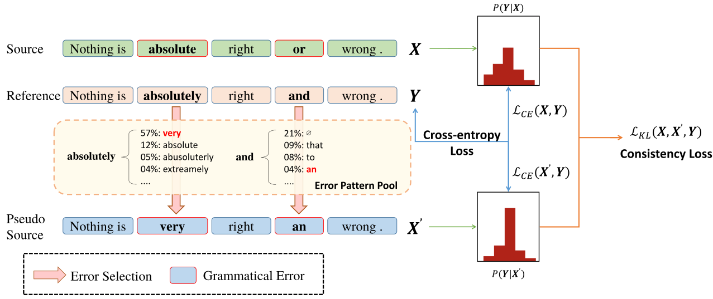
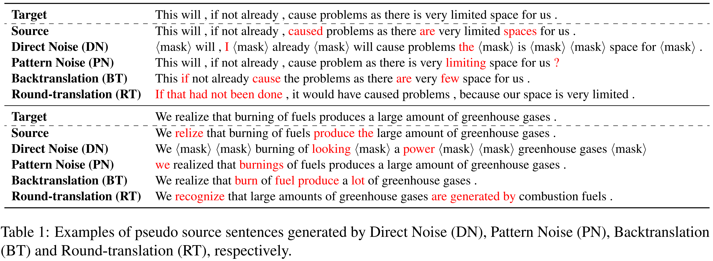

# MixEdit: Revisiting Data Augmentation and Beyond for Grammatical Error Correction

</div>

The repository contains the codes and data for our EMNLP-2023 Paper: [MixEdit: Revisiting Data Augmentation and Beyond for Grammatical Error Correction](https://arxiv.org/abs/2310.11671).

## 1 Overview

MixEdit is a data augmentation approach that *strategically* and *dynamically* augments realistic data, without requiring extra monolingual corpora.



## 2 Features

- We open-source **training** and **inference** pipelines of GEC models equipped with MixEdit in English and Chinese. Well-trained checkpoints are also released.
- We incorporate four kinds of traditional data augmentation methods discussed in the paper, including Direct Noise (DN), Pattern Noise (PN), Back-Translation (BT) and Round Translation (RT).
- We open-source the toolkit used for computing **Affinity** and **Diversity**, which reveal two core perspectives of GEC data augmentation.

## 3 Requirements and Installation

- Python version >= 3.7

- `fairseq` == 0.12.2
- `transformers` >= 4.28.1

### Clone this repository

```bash
git clone https://github.com/THUKElab/MixEdit.git
cd ./MixEdit
```

### Description of Codes

```python
MixEdit                             # Root
├── augmenters                      # GEC data augmentation methods
└── metrics                         # Metrics used to evaluate GEC systems
└── models                     
    └── bart                        # BART-based MixEdit model
    └── preprocess                  # Proprocessed data files for fairseq training
        └── eng
        └── zho
    └── exps                        # Trained model chekpoints and logs
        └── eng
        └── zho
    └── interactive.py              # Inference code
    └── train.py                    # Training code
    └── trainer.py                  # Revised from official fairseq trainer.py
└── processors                      # pre- or post- data processors
└── scripts
    └── fairseq                     # Training scripts for fairseq training
    └── metrics                     # Evaluation scripts
└── utils.py                        # Some tools
```

## 4 Datasets

### 4.1 Preprocess Datasets for Fairseq Training

You can directly download the preprocessed binary English and Chinese data files from this [Link](https://cloud.tsinghua.edu.cn/f/f247138bf51b41d78126/). Then, unzip the `preprocess.tar` in `MixEdit/models/bart/preprocess`. **Note that you must get their licenses first!**

If you want to train new models using your own datasets, please follow the instructions in `scripts/fairseq`.

### 4.2 Data Augmentation

Traditional GEC data augmentation methods generate pseudo parallel data by corrupting seed corpus.



#### 4.2.1 Direct Noise (DN)

Direct Noise (DN) injects noise into grammatically correct sentences in a rule-based manner [(Kiyono et al., 2020)](https://github.com/butsugiri/gec-pseudodata). The noise can take the form of 1) masking, 2) deletion, and 3) insertion based on pre-defined probabilities.

#### 4.2.2 Pattern Noise (PN)

Pattern Noise (PN) involves injecting grammatical errors that are already present in the realistic GEC dataset into sentences [(Choe et al., 2019)](https://github.com/kakaobrain/helo-word).

#### 4.2.3 Back-Translation (BT)

Back-Translation (BT) generates more genuine grammatical errors by learning the distribution of human written grammatical errors (Xie et al., 2018). The noisy model is trained with the inverse of GEC parallel dataset, where ungrammatical sentence are treated as the target and grammatical ones as the source.

To implement BT, you should follow the instructions:

1. `./augmenters/backtranslation/train_eng.sh`: train noisy models with the inverse of GEC parallel dataset.
2. `./augmenters/backtranslation/peredict_eng.sh`: corrupt grammatical sentences into ungrammatical ones.

We provide trained noisy models for convenience, so that you can skip the first step.

| Model Name                                                   | Description                                        | Training Sets |
| ------------------------------------------------------------ | -------------------------------------------------- | ------------- |
| [**BT-eng**](https://cloud.tsinghua.edu.cn/f/77ac291bc4f44c198b73/) | English Back-Translation Model based on BART-Large | CLang-8       |
| [**BT-zho**](https://cloud.tsinghua.edu.cn/f/85de9d85eb4647c5a7fa/) | Chinese Back-Translation Model based on BART-Large | HSK + Lang8   |

#### 4.2.4 Round-Translation (RT)

Round-Translation (RT) is an alternative method to generate pseudo data, which is based on the assumption that NMT systems may produce translation errors, resulting in noisy outputs via the bridge languages (Lichtarge et al., 2019; Zhou et al., 2020). The diverse outputs, however, may change the structure of the sentence due to the heterogeneity of different languages.

We implement RT in `MixEdit/augmenters/round_translation.py` by leveraging off-the-shelf en-zh and zh-en translation models (Tiedemann and Thottingal, 2020).

## 5 Affinity and Diversity

Affinity and Diversity are two low-cost and effective measures for analyzing GEC data augmentation methods.

- We define Affinity of a data augmentation method as the inverse of Kullback–Leibler (KL) divergence between pseudo and realistic grammatical errors.
- we define Diversity as the entropy of pseudo grammatical errors.

To compute these measures, you should acquire data files in m2 format by utilizing ERRANT.

Then, run the following codes to attain Affinity and Diversity.

```python
from augmenters.data import M2DataReader
from augmenters.measures import calc_edit_affinity, calc_edit_diversity

# Define M2 reader
reader_m2 = M2DataReader()

# Read data
data_hyp = self.reader_m2.read(hyp_file)
data_ref = self.reader_m2.read(ref_file)

# Calculate Affinity
affinity = calc_edit_affinity(data_ref, data_hyp)
print(f"Affinity between hyp and ref: {round(kl, 4)}")

# Calculate Diversity
diveristy_ref = calc_edit_diversity(data_ref)
diveristy_hyp = calc_edit_diversity(data_hyp)
print(f"Dataset Diversity: of ref: {round(diveristy_ref, 4)}")
print(f"Dataset Diversity: of hyp: {round(diveristy_hyp, 4)}")
```

## 6 Model Training and Inference

### 6.1 Checkpoints

If you are freshman to train models in `fairseq`, I recommend to first get familiar to the inference pipeline through the following converged checkpoints.

We report development performance indicated by Precision / Recall / $F_{0.5}$.

#### English Checkpoints

| Model Name                                                   | Description                        | BEA19-Dev                 |
| ------------------------------------------------------------ | ---------------------------------- | ------------------------- |
| [**BART Baseline**](https://cloud.tsinghua.edu.cn/f/2548a95171b14ea69cd2/) | Baseline Model based on BART-Large | 64.47 / 47.45 / 60.15     |
| [**BART MixEdit**](https://cloud.tsinghua.edu.cn/f/a74ba8c77650427db827/) | MixEdit Model based on BART-Large  | 67.05 / 47.18 / **61.84** |

#### Chinese Checkpoints

| Model Name                                                   | Description                        | MuCGEC-Dev                |
| ------------------------------------------------------------ | ---------------------------------- | ------------------------- |
| [**BART Baseline**](https://cloud.tsinghua.edu.cn/f/d40ba8c4e856493eb743/) | Baseline Model based on BART-Large | 51.83 / 28.32 / 44.45     |
| [**BART MixEdit**](https://cloud.tsinghua.edu.cn/f/7a205e791995428dab6b/) | MixEdit Model based on BART-Large  | 52.42 / 27.91 / **44.59** |

### 6.2 Pre-trained models

If you want to train GEC models from scratch, you should first download pre-trained BART models (English only).

| Model           | Description                                           | # params | Download                                                     |
| --------------- | ----------------------------------------------------- | -------- | ------------------------------------------------------------ |
| `bart.base`     | English BART model with 6 encoder and decoder layers  | 140M     | [bart.base.tar.gz](https://dl.fbaipublicfiles.com/fairseq/models/bart.base.tar.gz) |
| `bart.large`    | English BART model with 12 encoder and decoder layers | 400M     | [bart.large.tar.gz](https://dl.fbaipublicfiles.com/fairseq/models/bart.large.tar.gz) |
| `bart-zh.base`  | Chinese BART model with 6 encoder and decoder layers  | 140M     | [fnlp/bart-base-chinese](https://huggingface.co/fnlp/bart-base-chinese) |
| `bart-zh.large` | Chinese BART model with 12 encoder and decoder layers | 400M     | [fnlp/bart-large-chinese](https://huggingface.co/fnlp/bart-large-chinese) |

**Note**: `models/trainer.py` can automatically download Chinese BART model, so you needn't download in advance.

### 6.3 Training

> If you have downloaded our released checkpoints and not plan to train models from scratch, please skip this section.

If you want to train new models using your own dataset, please follow the instructions in `./scripts/eng/train_mixedit_demo.sh`:

1. `./scripts/fairseq/eng/preprocess.sh`: preprocess data from training GEC models using `fairseq` framework.
2. `./models/train.py`: train Baseline & MixEdit models.
3. `./scripts/fairseq/eng/predict.sh`: inference and evaluate GEC models.

### 6.4 Inference and Evaluate

Follow the instructions in `./scripts/*/predict.sh` to inference and evaluate GEC models. Some post-process handling is necessary for improved performance. Please refer to `./scripts/*/predict.sh` for more details.

We do not provide evaluation codes of [ChERRANT](https://github.com/HillZhang1999/MuCGEC) and [MaxMatch](http://www.comp.nus.edu.sg/∼nlp/software.html), please download them from their official links.

## Citation

If you think our work is helpful, please cite our paper:

```
@misc{ye2023mixedit,
      title={MixEdit: Revisiting Data Augmentation and Beyond for Grammatical Error Correction}, 
      author={Jingheng Ye and Yinghui Li and Yangning Li and Hai-Tao Zheng},
      year={2023},
      eprint={2310.11671},
      archivePrefix={arXiv},
      primaryClass={cs.CL}
}
```

## Contact & Feedback

If you have any questions or feedbacks, please send e-mails to ours: yejh22@mails.tsinghua.edu.cn, liyinghu20@mails.tsinghua.edu.cn.

## References

1. Shun Kiyono, Jun Suzuki, Tomoya Mizumoto, and Kentaro Inui. 2020. Massive exploration of pseudo data for grammatical error correction. *IEEE/ACM transactions on audio, speech, and language processing*, 28:2134–2145.
2. Yo Joong Choe, Jiyeon Ham, Kyubyong Park, and Yeoil Yoon. 2019. A neural grammatical error correction system built on better pre-training and sequential transfer learning. In *Proceedings of the Fourteenth Workshop on Innovative Use of NLP for Building Educational Applications*, pages 213–227, Florence, Italy. Association for Computational Linguistics.

